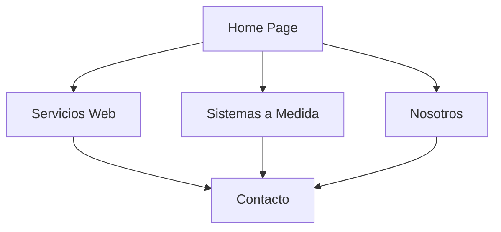

## 1. Product Overview

SYNTARA es una agencia tecnológica B2B especializada en Servicios Web y Desarrollo de Sistemas a Medida. La web corporativa tiene como objetivo transmitir máxima seguridad, modernidad y rendimiento excepcional para captar clientes corporativos.

El producto posiciona a SYNTARA como un partner tecnológico confiable para empresas que buscan soluciones digitales premium con enfoque en seguridad y escalabilidad.

## 2. Core Features

### 2.1 User Roles

| Role    | Registration Method      | Core Permissions                                      |
| ------- | ------------------------ | ----------------------------------------------------- |
| Visitor | No registration required | Browse all public content, contact forms              |
| Admin   | Backend authentication   | Manage content, view analytics, receive contact forms |

### 2.2 Feature Module

La web corporativa de SYNTARA consta de las siguientes páginas principales:

1. **Página de Inicio**: Hero section impactante, grilla de características, navegación principal.
2. **Servicios Web**: Detalle de servicios de desarrollo web empresarial.
3. **Sistemas a Medida**: Información sobre desarrollo de sistemas personalizados.
4. **Nosotros**: Presentación de la empresa y equipo.
5. **Contacto**: Formulario de contacto y canales de comunicación.

### 2.3 Page Details

| Page Name         | Module Name     | Feature description                                                                                                |
| ----------------- | --------------- | ------------------------------------------------------------------------------------------------------------------ |
| Home page         | Hero section    | Presentar titular impactante sobre soluciones tecnológicas rentables y seguras. Incluir CTA principal de contacto. |
| Home page         | Features Grid   | Mostrar 3 tarjetas destacando Velocidad, Seguridad y Escalabilidad con iconos modernos.                            |
| Home page         | Navigation      | Navbar fijo con logo SYNTARA y enlaces a secciones principales.                                                    |
| Home page         | Footer          | Información de contacto corporativa minimalista.                                                                   |
| Servicios Web     | Service Cards   | Detallar servicios de desarrollo web con casos de éxito.                                                           |
| Sistemas a Medida | System Showcase | Presentar capacidades de desarrollo personalizado.                                                                 |
| Nosotros          | Company Info    | Información sobre SYNTARA y valores corporativos.                                                                  |
| Contacto          | Contact Form    | Formulario con validación para consultas comerciales.                                                              |

## 3. Core Process

### Flujo de Usuario Corporativo

1. Usuario llega a la página principal
2. Visualiza hero section con propuesta de valor
3. Explora características principales (Velocidad, Seguridad, Escalabilidad)
4. Navega a secciones de servicios según interés
5. Accede a formulario de contacto para consultas
6. Envía información de contacto para seguimiento comercial

## 4. User Interface Design

### 4.1 Design Style

* **Colores Primarios**: Negro profundo (#0A0A0A) y grises oscuros (#1A1A1A)

* **Colores de Acento**: Azul eléctrico (#00B7C7) y esmeralda (#2ECBD3) con gradientes a índigo (#3B2F74)

* **Estilo de Botones**: Bordes redondeados con efectos hover sutiles

* **Tipografía**: Fuente sans-serif geométrica moderna, peso bold para títulos

* **Diseño de Tarjetas**: Card-based con sombras sutiles y bordes minimalistas

* **Iconos**: Estilo lineal moderno de lucide-react

### 4.2 Page Design Overview

| Page Name | Module Name   | UI Elements                                                                                                         |
| --------- | ------------- | ------------------------------------------------------------------------------------------------------------------- |
| Home page | Hero section  | Título en negrita geométrica, subtítulo en gris, botón CTA con gradiente teal-índigo, fondo oscuro con patrón sutil |
| Home page | Features Grid | Tarjetas con iconos grandes, títulos en blanco, descripciones en gris claro, bordes con gradiente sutil             |
| Home page | Navbar        | Logo SYNTARA con gradiente, enlaces en blanco con hover en acento, botón contacto destacado                         |
| Home page | Footer        | Texto en gris claro, enlaces mínimos, diseño ultra-clean                                                            |

### 4.3 Responsiveness

* Diseño desktop-first con adaptación móvil

* Breakpoints: 640px, 768px, 1024px, 1280px

* Menú hamburger para móviles

* Grid responsive para características

* Tipografía escalable

### 4.4 Animaciones

* Transiciones suaves con framer-motion

* Parallax sutil en hero section

* Hover effects en tarjetas y botones

* Animaciones de entrada al hacer scroll

* Micro-interacciones en formularios

