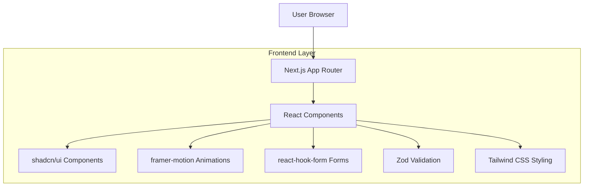

## 1. Architecture design



## 2. Technology Description

- **Frontend**: Next.js 14 (App Router) + TypeScript + React 18
- **Initialization Tool**: create-next-app
- **Styling**: Tailwind CSS 3
- **UI Components**: shadcn/ui
- **Animations**: framer-motion
- **Form Handling**: react-hook-form
- **Validation**: Zod
- **Icons**: lucide-react
- **Backend**: None (Static site generation)

## 3. Route definitions

| Route | Purpose |
|-------|---------|
| / | Home page, hero section and features grid |
| /servicios-web | Services page for web development offerings |
| /sistemas-medida | Custom systems development page |
| /nosotros | About us page with company information |
| /contacto | Contact page with form |

## 4. Component Architecture

### 4.1 Core Components

```typescript
// Layout Components
interface LayoutProps {
  children: React.ReactNode;
}

interface NavbarProps {
  logo: string;
  links: NavLink[];
}

interface FooterProps {
  companyName: string;
  contactInfo: ContactInfo;
}

// UI Components
interface ButtonProps {
  variant: 'primary' | 'secondary' | 'outline';
  size: 'sm' | 'md' | 'lg';
  children: React.ReactNode;
  onClick?: () => void;
}

interface CardProps {
  title: string;
  description: string;
  icon: React.ReactNode;
  className?: string;
}

interface InputProps {
  type: 'text' | 'email' | 'tel';
  placeholder: string;
  required?: boolean;
  register: UseFormRegister;
}

// Form Components
interface ContactFormData {
  name: string;
  email: string;
  company: string;
  message: string;
}

interface FormFieldProps {
  name: string;
  label: string;
  type: string;
  placeholder: string;
  validation: object;
}
```

### 4.2 Page Components

```typescript
// Home Page
interface HeroSectionProps {
  title: string;
  subtitle: string;
  ctaText: string;
}

interface FeatureCard {
  id: string;
  title: string;
  description: string;
  icon: string;
}

interface FeaturesGridProps {
  features: FeatureCard[];
}
```

## 5. Styling Configuration

### 5.1 Tailwind Configuration

```javascript
// tailwind.config.js
module.exports = {
  darkMode: 'class',
  theme: {
    extend: {
      colors: {
        primary: {
          50: '#f0f9ff',
          100: '#e0f2fe',
          500: '#00B7C7',
          600: '#0891b2',
          900: '#0c4a6e',
        },
        accent: {
          teal: '#2ECBD3',
          indigo: '#3B2F74',
        },
        dark: {
          50: '#f8fafc',
          100: '#f1f5f9',
          900: '#0A0A0A',
          950: '#020617',
        }
      },
      animation: {
        'fade-in': 'fadeIn 0.5s ease-in-out',
        'slide-up': 'slideUp 0.3s ease-out',
      }
    }
  }
}
```

### 5.2 Global Styles

```css
/* globals.css */
@layer base {
  :root {
    --background: 0 0% 100%;
    --foreground: 222.2 84% 4.9%;
    --primary: 187 100% 39%; /* #00B7C7 */
    --primary-foreground: 210 40% 98%;
    --accent: 184 72% 47%; /* #2ECBD3 */
  }

  .dark {
    --background: 222.2 84% 4.9%;
    --foreground: 210 40% 98%;
    --primary: 187 100% 39%;
    --primary-foreground: 222.2 84% 4.9%;
  }
}
```

## 6. Performance Optimization

### 6.1 Next.js Configuration

```javascript
// next.config.js
module.exports = {
  images: {
    domains: ['localhost'],
    formats: ['image/webp', 'image/avif'],
  },
  experimental: {
    optimizeCss: true,
  },
  compiler: {
    removeConsole: process.env.NODE_ENV === 'production',
  },
}
```

### 6.2 Component Optimization

- Implementación de lazy loading para componentes pesados
- Uso de React.memo para componentes estáticos
- Optimización de imágenes con next/image
- Prefetch de rutas críticas
- Caché de estáticos con stale-while-revalidate

## 7. Build and Deployment

### 7.1 Build Process

```bash
# Development
npm run dev

# Production build
npm run build

# Static export
npm run build && npm run export
```

### 7.2 Deployment Targets

- **Vercel**: Deploy automático con Git integration
- **Netlify**: Static site hosting con CDN global
- **AWS S3 + CloudFront**: Solución enterprise con edge caching